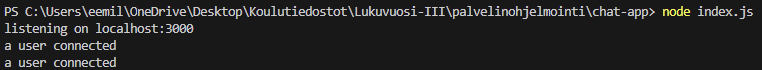
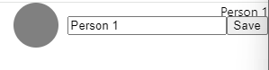
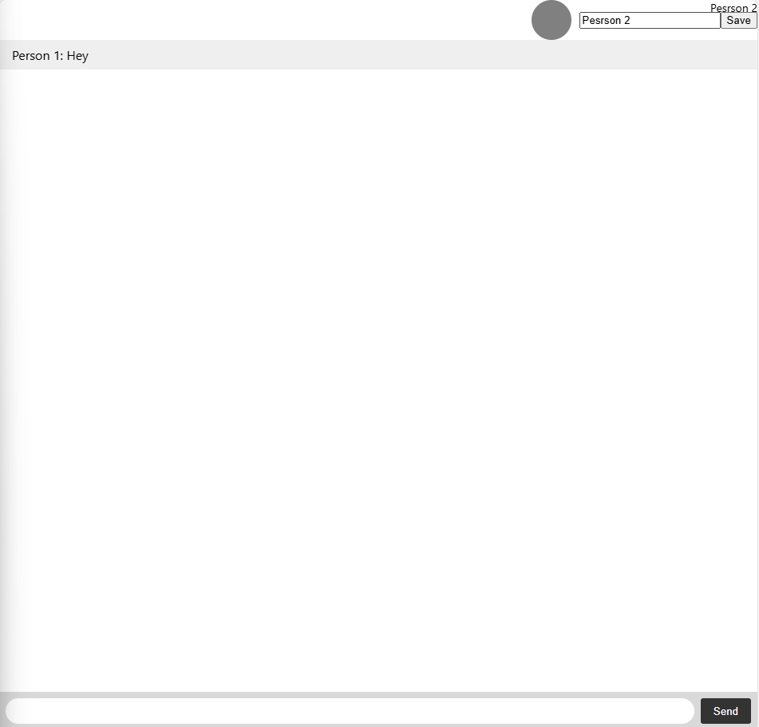
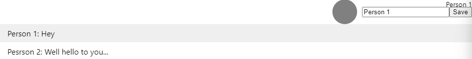
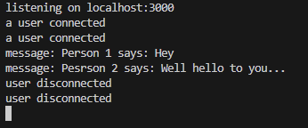

# Chat app

## Starting the app locally

We can see two users connecting to the app.

## Nicknames / Usernames

Person who connects can type in a username that is visible to all other chatters.

## Messaging

Next picture shows "Person 2" receiving "Person 1's" message: "Hey".

Next picture shows "Person 1" receiving "Person 2's" message: "Well hello to you".

## Users disconnecting

# Namespaces and how are they different from rooms and how could I use those in my app?

## Namespaces

Namespaces allow segregation of communication logic. This makes is easier to manage connections and events. Every namespace can have its own events, middleware and logic.

## Namespaces vs Rooms

Rooms allow the grouping of sockets within a namespace so Rooms are lower in hierarchy. A namespace can contain multiple rooms but rooms are confined to only one namespace.

## Using namespaces and rooms in my app

My chat could handle chat-related events with a namespace that had rooms for different channels or chat rooms.
